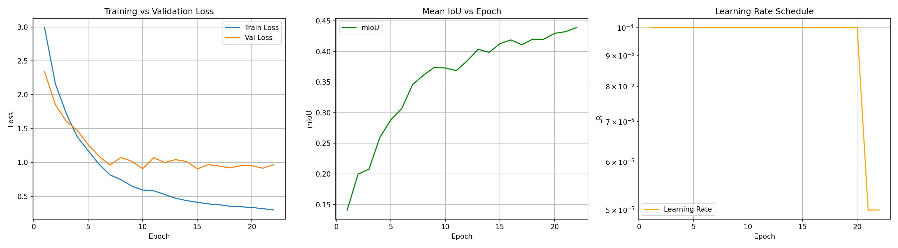
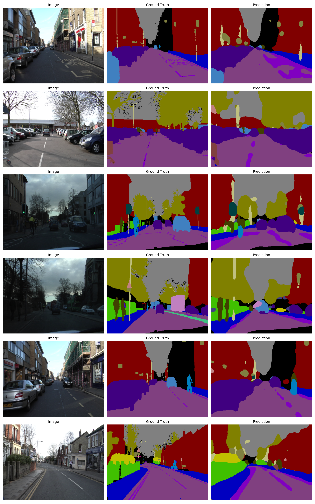

# Camera Semantic Segmentation Pipeline (ROS2 + Docker)

A real-time **ROS2 perception pipeline** for semantic segmentation and drivable-area extraction from camera input.

The system uses a **DeepLabV3 model trained on CamVid** and deploys it in a modular ROS2 architecture with mixed **C++ and Python nodes**, fully containerized using Docker.

> Focus: Not just training a model, but building a **deployable robotics perception system**

---

## What this project demonstrates

* End-to-end **perception pipeline (training → deployment)**
* Integration of **PyTorch (TorchScript) with ROS2**
* Mixed-language robotics architecture (**C++ + Python**)
* Real-time image processing using **OpenCV + ROS2**
* Containerized deployment using **Docker**
* Modular system design similar to real autonomous driving stacks

---

## System Overview

This project simulates a real autonomous driving perception pipeline using a video feed instead of a live camera.

### Pipeline

```
test.mp4
   ↓
video_camera_node (C++)
   ↓
/camera/image_raw
   ↓
segmentation_node (Python)
   ↓
/perception/segmentation
   ↓
drivable_area_node (C++)
   ↓
/perception/drivable_area
```

---

## Why mixed C++ and Python?

This system separates responsibilities based on real-world robotics practices:

### C++ Nodes

* Camera simulation (video publisher)
* Drivable area extraction
* Efficient image processing using OpenCV
* Low-latency ROS2 communication

### Python Node

* Deep learning inference using PyTorch (TorchScript)

### Key Engineering Challenge

Ensuring seamless communication between nodes:

* Consistent ROS2 message formats
* Synchronization across nodes
* Efficient data transfer between C++ and Python

---

## Demo Outputs

### Input Video

* `data/test.mp4`

### Segmentation Output

* `output/segmentation_output.mp4`

### Drivable Area Output

* `output/drivable_area_output.mp4`

These outputs demonstrate:

* Real-time semantic segmentation
* Extraction of drivable regions from road scenes

---

## Training Results

### Training Curves



### Test Predictions



---

## Model Details

* **Architecture:** DeepLabV3 (ResNet backbone)
* **Dataset:** CamVid (~700 annotated images)
* **Deployment Format:** TorchScript (`.pt`)
* **Best Validation mIoU:** ~0.43
* **Test mIoU / Jaccard Index:** ~0.39

Due to the small dataset size, the focus was not maximizing benchmark performance,
but validating a **complete perception pipeline from training to deployment**.

---

## System Design Insight

The pipeline is intentionally modular:

* Each node performs a **single responsibility**
* Communication happens via **ROS2 topics**
* Components can be replaced independently

This enables:

* Easy model swapping
* Scalable system design
* Easier debugging and testing

This architecture mirrors real-world autonomous driving systems.

---

## Repository Structure

```
ros2_ws/src/
  video_camera_node_cpp/     # C++ camera publisher (video → ROS2)
  segmentation_node_py/      # Python TorchScript inference
  drivable_area_node_cpp/    # C++ drivable area extraction
  perception_launch/         # Launch files

data/
  test.mp4

output/
  segmentation_output.mp4
  drivable_area_output.mp4

model/
  segmentation_model_camvid.pt
  class_dict.csv

training_curves.png
test_predictions.png

docker-compose.yml
Dockerfile
```

---

## Running the Project

### Requirements

* Docker
* Docker Compose

### Steps

```bash
docker compose build
docker compose up
```

Outputs will be saved in:

```
./output/
```

---

## Extending the Project

* Swap model: Replace `segmentation_model_camvid.pt` with any TorchScript model
* Change input: Modify video source in camera node
* Add evaluation metrics inside segmentation node
* Integrate with simulation environments

---

## Future Improvements

* Train on larger datasets (e.g., BDD100K) for improved segmentation performance
* Add **depth estimation** using stereo camera setup
* Extend pipeline for:

  * Adaptive Cruise Control (ACC)
  * Collision avoidance
  * Path planning
* Integrate with simulators like CARLA
* Optimize inference using ONNX / TensorRT

---

## 🧠 Final Note

This project focuses on **bridging the gap between deep learning and robotics systems**.

Rather than treating segmentation as a standalone task, it demonstrates how a trained model can be integrated into a **real-time perception pipeline**, similar to those used in autonomous driving systems.
